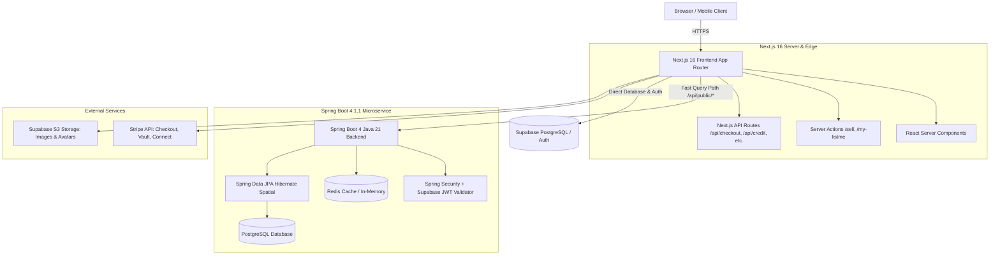
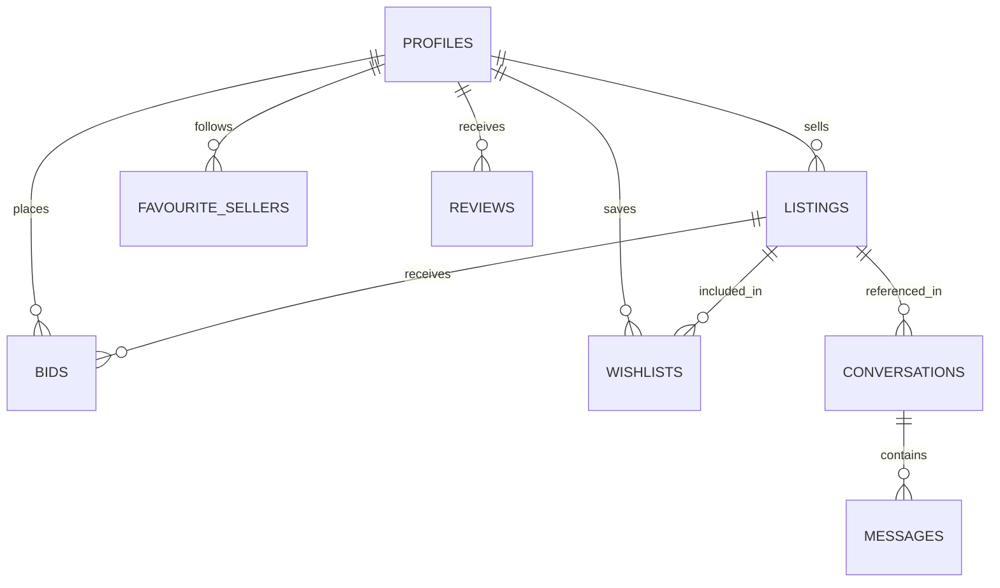

# ListMe.ie — Complete Architectural & Codebase Documentation

> **Comprehensive Technical Manual & System Architecture**  
> *Target Workspace*: `/home/sahleyis/Documents/Listme`  
> *Platform*: Ireland's Modern Peer-to-Peer & Business Marketplace  
> *Stack*: Next.js 16 (Turbopack, React 19), Spring Boot 4 / Java 21, Supabase (PostgreSQL, Auth, Storage), Stripe Payments & Connect  

---

## Table of Contents
1. [Executive Overview & Core Principles](#1-executive-overview--core-principles)
2. [High-Level Architecture & Topology](#2-high-level-architecture--topology)
3. [Repository Structure & Workspace Orchestration](#3-repository-structure--workspace-orchestration)
4. [Backend Engine — Spring Boot & Java 21](#4-backend-engine--spring-boot--java-21)
5. [Frontend Engine — Next.js 16 App Router](#5-frontend-engine--nextjs-16-app-router)
6. [Complete Route Catalog (All 43 Routes)](#6-complete-route-catalog-all-43-routes)
7. [Server Actions & Business Logic Layer](#7-server-actions--business-logic-layer)
8. [API Endpoints & Background Services](#8-api-endpoints--background-services)
9. [Component Architecture & Design System](#9-component-architecture--design-system)
10. [Database Schema & Data Persistence](#10-database-schema--data-persistence)
11. [Payments, Escrow & Financial Flow](#11-payments-escrow--financial-flow)
12. [Security, Fraud Prevention & Compliance](#12-security-fraud-prevention--compliance)
13. [Local Development, Docker & Production Deployment](#13-local-development-docker--production-deployment)

---

## 1. Executive Overview & Core Principles

**ListMe** is an authentic, high-contrast, peer-to-peer and verified business marketplace tailored specifically to the Republic of Ireland. Built as an alternative to outdated classifieds (like Adverts.ie and DoneDeal) and inspired by New Zealand's Trade Me, ListMe bridges casual trading, verified storefronts, job recruitment, and local trade services.

### Core Architectural Axioms
1. **0% Seller Success Fees**: Casual and individual sellers keep 100% of their sale proceeds.
2. **Transparent Platform Service Fee**: A tiered 3.0% – 4.0% fee is paid by buyers at checkout to fund Buyer Protection coverage up to €5,000 and fraud mitigation.
3. **Strict Republic of Ireland Localization**:
   - Locked to the 26 core counties of the Republic of Ireland.
   - Contact numbers locked to the Irish international prefix (`+353`).
4. **Hybrid Dual-Engine Architecture**:
   - **Frontend**: Next.js 16 (App Router, Turbopack, React 19) providing Server-Side Rendering (SSR), Server Actions, and dynamic client interactivity.
   - **Backend**: Spring Boot 4.1.1 running on Java 21, providing high-throughput cached query APIs, JWT token introspection, and Redis caching.
   - **Database & Auth**: Supabase PostgreSQL with PostGIS capabilities, row-level security, realtime engine, and S3-compatible storage.
5. **No "AI-Vibe-Coded" Aesthetics**:
   - Zero gradients (`bg-gradient-to-...` is strictly forbidden).
   - Zero glowing neon pills or pseudo-futuristic green shadows.
   - Solid, flat, Trade Me-style surfaces with clean dark mode (`#181818`, `#121212`) and crisp borders (`border-zinc-800`).

---

## 2. High-Level Architecture & Topology



### Communication Protocols
- **Client to Frontend**: HTTPS, Next.js Streaming SSR, React Server Actions.
- **Frontend to Java Backend**: REST over HTTP/2, passing Supabase OAuth2 Bearer tokens in headers (`Authorization: Bearer <jwt>`).
- **Frontend to Supabase**: `@supabase/ssr` cookies-based auth for SSR and `@supabase/supabase-js` client SDK with PostgREST.
- **Failover / Resilient Fallback**: `utils/backendApi.ts` implements a 3-second circuit breaker. If the Java backend is unreachable or under deployment, requests fall back seamlessly to direct Supabase PostgREST queries without downtime.

---

## 3. Repository Structure & Workspace Orchestration

The ListMe repository is arranged as a multi-tier monorepo:

```
Listme/
├── backend/                       # Spring Boot 4 / Java 21 REST API
│   ├── src/main/java/ie/listit/   # Controllers, Models, Repositories, Config
│   ├── src/main/resources/        # application.yml
│   └── pom.xml                    # Maven build file
├── frontend/                      # Next.js 16 App Router application
│   ├── public/                    # Static brand assets & logos
│   ├── src/
│   │   ├── app/                   # 43 App Router routes & API endpoints
│   │   ├── components/            # Reusable modular UI components
│   │   ├── context/               # React Contexts (WatchlistContext)
│   │   └── utils/                 # Utilities, location data, Supabase helpers
│   ├── package.json               # Frontend dependencies & Next scripts
│   └── tsconfig.json              # TypeScript strict configuration
├── docker-compose.yml             # Local PostgreSQL (PostGIS) & Redis containers
├── documentation/                 # Architectural manuals & repository documentation
├── package.json                   # Root orchestrator scripts (concurrently dev runner)
└── remove_bg.py                   # Python background removal script for assets
```

### Root Package Scripts (`package.json`)
- `npm run dev`: Runs both `dev:frontend` and `dev:backend` concurrently.
- `npm run dev:frontend`: Starts Next.js with `NODE_OPTIONS='--dns-result-order=ipv4first' next dev`.
- `npm run dev:backend`: Exports Java 21 environment and boots Spring Boot via `./mvnw spring-boot:run`.
- `npm run build`: Triggers production bundle build in `frontend/`.
- `npm run db:up` / `db:down`: Starts or tears down local Docker containers (`postgis/postgis:15-3.3` on port 5432, `redis:7-alpine` on port 6379).

---

## 4. Backend Engine — Spring Boot & Java 21

Located in `backend/`, the Java microservice provides high-throughput query handling, entity persistence, and token-based API security.

### 4.1 Dependency Stack (`backend/pom.xml`)
- **Parent**: `org.springframework.boot:spring-boot-starter-parent:4.1.1`
- **Java Version**: `21`
- **Key Starters**:
  - `spring-boot-starter-webmvc`: Embedded Tomcat HTTP server.
  - `spring-boot-starter-data-jpa`: Hibernate 7 ORM persistence.
  - `spring-boot-starter-data-redis`: Cache layer for popular listings.
  - `spring-boot-starter-security`: Spring Security 6 framework.
  - `spring-boot-starter-oauth2-resource-server`: Decodes and verifies Supabase JWT access tokens against the Supabase Auth JWKS public keys.
  - `com.stripe:stripe-java:25.4.0`: Official Stripe Java SDK.
  - `org.postgresql:postgresql`: JDBC database driver.
  - `org.hibernate.orm:hibernate-spatial`: PostGIS geometry integration.
  - `org.projectlombok:lombok`: Boilerplate reduction (`@Data`, `@NoArgsConstructor`).

### 4.2 Security Configuration (`SecurityConfig.java`)
- **CORS Configuration**: Explicitly whitelists `http://localhost:3000`, `https://listme.vercel.app`, and `https://*.vercel.app`. Permits `GET, POST, PUT, PATCH, DELETE, OPTIONS`.
- **CSRF**: Disabled (`AbstractHttpConfigurer::disable`) for stateless API architecture.
- **Authorization Rules**:
  - Public endpoints (`/api/public/**`) permit all traffic without authentication.
  - Any other request (`/api/checkout`, `/api/connect`) mandates a valid JWT passed via `Authorization: Bearer <token>`.
- **JWT Introspection**: Validates token issuer against `SUPABASE_URL/auth/v1`.

### 4.3 Public Listing Controller (`ListingPublicController.java`)
Path: `/api/public/listings`
- `@GetMapping("/home")`: Returns both latest active listings and active auction listings in a single round-trip, cached in Redis via `@Cacheable("homeListings")`.
- `@GetMapping`: Query endpoint supporting filtering by `category`, `priceType`, `q` (search term), and pagination with limit bounding (`Math.min(Math.max(limit, 1), 100)`).
- `@GetMapping("/{id}")`: Retrieves a single listing by UUID with `@Cacheable(value = "singleListing", key = "#id")`.

### 4.4 Domain Entity (`Listing.java`)
Maps directly to the `public.listings` PostgreSQL table:
- `id` (`UUID`, primary key generated via `GenerationType.UUID`)
- `sellerId` (`UUID`, maps to `seller_id`)
- `title` (`String`, non-null)
- `description` (`String`, `columnDefinition = "text"`)
- `category` (`String`), `condition` (`String`), `priceType` (`String`)
- `price` (`BigDecimal`, non-null)
- `images` (`String[]`, native PostgreSQL `text[]`)
- `status` (`String`, e.g. `'active'`, `'closed'`)
- `location` (`String`, Irish county)
- `expiresAt`, `endsAt`, `createdAt`, `updatedAt` (`OffsetDateTime`)

---

## 5. Frontend Engine — Next.js 16 App Router

Located in `frontend/`, the Next.js application leverages Next.js 16 Turbopack and React 19.

### Key Architectural Patterns
1. **Server & Client Component Separation**: Pages default to React Server Components (RSC) to fetch database records directly on the server without client bundles, while interactive elements (`Modal`, `Form`, `Slider`, `Chat`) are segregated into client components marked with `'use client'`.
2. **Supabase SSR Cookie Integration**:
   - `utils/supabase/server.ts`: Uses `createServerClient` from `@supabase/ssr` to read/write auth tokens stored in encrypted cookies.
   - `utils/supabase/client.ts`: Uses `createBrowserClient` for browser-side auth listeners and real-time channels.
   - `utils/supabase/storage.ts`: Handles secure S3 file uploads directly to Supabase storage buckets (`listings`).
3. **Resilient Dual-Query Utility (`utils/backendApi.ts`)**:
   Provides helper functions (`fetchPublicListings`, `fetchHomeListings`, `fetchListingById`) that attempt to query the high-speed Spring Boot backend first, gracefully falling back to Supabase PostgREST if the microservice is offline.

---

## 6. Complete Route Catalog (All 43 Routes)

| Route Path | Type | File Location | Purpose & Core Behavior |
| :--- | :--- | :--- | :--- |
| `/` | Server (SSR) | `app/page.tsx` | Main landing page: Hero, CategoriesMegaMenu, PromoBanners, TrendingCategories, Auctions & Buy-Now showcase. |
| `/browse` | Client | `app/browse/page.tsx` | Universal marketplace catalog with search, price filters, county selector, and auction toggle. |
| `/category/[slug]` | Client | `app/category/[slug]/page.tsx` | Category-specific product grids (`marketplace`, `jobs`, `services`, `motors`, `property`). |
| `/listing/[id]` | Server (SSR) | `app/listing/[id]/page.tsx` | Comprehensive listing view: gallery, seller trust card, bid history, make offer modal, instant buy, review summary. |
| `/sell` | Client | `app/sell/page.tsx` | 3-Branch Trade Me listing wizard (**Item**, **Job**, **Service**), business account validation, and marketplace store selector. |
| `/my-listme` | Server (SSR) | `app/my-listme/page.tsx` | Account Command Center: 8 tabs (Listings, Selling, Watchlist, Favourite Sellers, Business Pages, Wallet, Notifications, Settings). |
| `/page/[slug]` | Server (SSR) | `app/page/[slug]/page.tsx` | Subsidiary Business Storefront / Service Hub showcasing opening hours, announcements, and storefront inventory. |
| `/messages` | Client | `app/messages/page.tsx` | Direct messaging inbox, conversation thread viewer, real-time message sending, and 3-day inactive chat cleanup. |
| `/watchlist` | Client | `app/watchlist/page.tsx` | User's saved items & auction tracking with instant notifications and bid status. |
| `/favourite-sellers`| Server (SSR)| `app/favourite-sellers/page.tsx`| Persistent sidebar redirect routing directly to `/my-listme?tab=favourite-sellers`. |
| `/help` | Client | `app/help/page.tsx` | Two-column Trade Me Help Centre: sticky navigation, Discord-style support tickets, and resource links. |
| `/support` | Server | `app/support/page.tsx` | Permanent 301 redirect forwarding to `/help`. |
| `/community` | Server (SSR) | `app/community/page.tsx` | Honest database metrics (active listings, members, counties), official announcements, and community rules. |
| `/buyer-protection` | Static | `app/buyer-protection/page.tsx`| Official €5,000 protection charter, 30-day claim terms, and dispute resolution guidelines. |
| `/fees` | Static | `app/fees/page.tsx` | Marketplace fee schedule: 0% casual seller fee, 3.0%–4.0% buyer service fee, and in-trade terms. |
| `/marketplace-fees` | Static | `app/marketplace-fees/page.tsx`| Alias redirect pointing to `/fees`. |
| `/privacy` | Client | `app/privacy/page.tsx` | GDPR-compliant privacy policy with expandable clause navigation (applies to all registered members). |
| `/terms` | Client | `app/terms/page.tsx` | Site terms and trading agreement with expandable legal clauses. |
| `/login` | Client | `app/login/page.tsx` | User authentication via email/password or Magic Link with redirect validation. |
| `/register` | Client | `app/register/page.tsx` | New account onboarding with personal or business account type selection. |
| `/auth/callback` | Server Route | `app/auth/callback/route.ts` | Handles Supabase OAuth/Magic Link code exchange and sets session cookies. |
| `/auth/signout` | Server Route | `app/auth/signout/route.ts` | Clears Supabase session cookies and terminates session. |
| `/stripe-setup` | Client | `app/stripe-setup/page.tsx` | Initiates Stripe Connect Express onboarding for sellers to receive bank payouts. |
| `/stripe-setup/success` | Server | `app/stripe-setup/success/page.tsx` | Callback page confirming successful Stripe Connect bank linkage. |
| `/wallet-setup/success` | Server | `app/wallet-setup/success/page.tsx` | Callback confirming card successfully tokenized into Stripe PCI Vault. |
| `/payment-success` | Server (SSR) | `app/payment-success/page.tsx` | Post-checkout fulfillment: verifies Stripe session, closes listing, and notifies seller in chat. |
| `/leave-review/[listingId]` | Client | `app/leave-review/[listingId]/page.tsx` | 5-star rating and text review submission for completed trades. |
| `/member/[id]` | Server (SSR) | `app/member/[id]/page.tsx` | Public member profile displaying feedback score, member since date, and active listings. |
| `/a/member/[id]` | Server | `app/a/member/[id]/page.tsx` | Short URL alias for member profiles. |
| `/search` | Client | `app/search/page.tsx` | Dedicated search results page with keyword highlighting and query facets. |
| `/jobs` | Static | `app/jobs/page.tsx` | Alias landing page filtering listings by `category=Jobs`. |
| `/services` | Static | `app/services/page.tsx` | Alias landing page filtering listings by `category=Services`. |
| `/motors` | Server (SSR) | `app/motors/page.tsx` | Dedicated automotive vehicle classifieds filter. |
| `/property` | Server (SSR) | `app/property/page.tsx` | Real estate and property rental listings filter. |
| `/marketplace` | Server (SSR) | `app/marketplace/page.tsx` | Core physical goods marketplace index. |
| `/settings` | Server | `app/settings/page.tsx` | Redirects to `/my-listme?tab=settings`. |
| `/sitemap.xml` | Route Handler| `app/sitemap.ts` | Dynamic XML sitemap indexing all active listings, categories, and legal pages. |
| `/robots.txt` | Route Handler| `app/robots.ts` | Search engine crawl directives. |
| `/icon.png` | Static | `app/icon.png` | Favicon and app bookmark icon. |
| `/_not-found` | Static | `app/not-found.tsx` | Custom 404 page styled with Trade Me neutral aesthetics. |

---

## 7. Server Actions & Business Logic Layer

Server actions in `frontend/src/app/actions/` execute directly on the server with elevated privileges and automatic cache revalidation:

### 7.1 Listing Lifecycle (`app/sell/actions.ts`)
- `createListing(formData)`:
  - Validates user session and verifies seller has completed Stripe Connect onboarding.
  - Constructs Trade Me metadata tags embedded into `description`:
    - `[Business Page: <slug> | <name>]`
    - `[Job: <type> | Salary: <salary> | Company: <company>]`
    - `[Service: <category> | Pricing: <model>]`
    - `[Buy It Now: €<price>]`
  - Calculates expiration date (`durationDays * 24h`).
  - Executes resilient database insertion into `listings` table, revalidating `/`, `/browse`, and `/page/[slug]`.

### 7.2 Business Page Engine (`app/actions/businessPages.ts`)
- `createOrUpdateBusinessPage(data)`:
  - Validates business ownership.
  - Normalizes slug: `.toLowerCase().replace(/[^a-z0-9-]/g, '-')`.
  - Formats phone numbers to Irish format (`+353 ...`).
  - Truncates announcements to strict 250-character maximum.
  - Persists subsidiary page into `user.user_metadata.business_pages`.
- `deleteBusinessPage(pageId)`: Removes business page from metadata array.

### 7.3 Bidding & Offers (`app/actions/bids.ts`, `app/actions/offers.ts`)
- `placeBid(listingId, amount)`:
  - Validates auction is active and `amount > currentHighestBid`.
  - Inserts bid record into `bids` table.
  - Sends realtime notification to previous highest bidder that they have been outbid.
- `submitOffer(listingId, offerPrice, message)`:
  - Validates minimum offer thresholds.
  - Creates offer record and initiates or continues a conversation thread with the seller.
- `acceptOffer(offerId)` / `rejectOffer(offerId)`:
  - Updates offer status.
  - If accepted, locks item and notifies buyer to proceed to checkout.

### 7.4 Auto-Relisting & Watchlist (`app/actions/relist.ts`, `app/actions/wishlist.ts`)
- `relistListing(listingId, durationDays)`:
  - Re-activates closed or expired listings with a fresh 7-day or 14-day window.
- `toggleWishlist(listingId)`:
  - Adds or removes listing from `wishlists` table.
  - Synchronized globally via `WatchlistContext.tsx` and mirrored in `localStorage`.

---

## 8. API Endpoints & Background Services

All API endpoints reside in `frontend/src/app/api/`:

### 8.1 Checkout API (`app/api/checkout/route.ts`)
- Computes `priceInCents` and `calculateServiceFee(price)`.
- Adds two line items:
  1. Primary Listing Item.
  2. `Listme Service Fee (3.0% - 4.0%)` with description `"Platform operation and Buyer Protection coverage up to €5,000"`.
- Creates a Stripe Checkout Session with `mode: 'payment'`.
- Sets metadata (`listing_id`, `buyer_id`, `seller_id`, `service_fee`).

### 8.2 Stripe Connect API (`app/api/connect/route.ts`)
- **Dual-Version Compatibility**: Attempts modern Stripe Accounts v2 API creation (`stripe.v2.core.accounts.create`) with fallback to Accounts v1 Express (`stripe.accounts.create`).
- Configures Irish standard capabilities (`transfers: { requested: true }`).
- Generates onboarding links (`stripe.accountLinks.create`) with auto-recovery for expired links.
- `connect/login/route.ts`: Generates single-sign-on Stripe Express dashboard login links (`createLoginLink`).

### 8.3 Wallet & Credit Top-Up API (`app/api/credit/topup/route.ts`, `app/api/wallet/setup/route.ts`)
- `wallet/setup/route.ts`: Generates a Stripe Checkout session in `mode: 'setup'` to vault customer credit cards under PCI SAQ-A compliance without card numbers ever touching ListMe servers.
- `credit/topup/route.ts`:
  - **Option A (Saved Card)**: Executes an off-session Stripe `PaymentIntent.create` with `customer` and `payment_method` for instant 1-click top-up authorized by 4-digit PIN.
  - **Option B (New Card)**: Creates a Stripe Checkout top-up session.
  - Deposits 100% of top-up funds into the user's `account_credit` virtual wallet.

### 8.4 Automated Chat Cleanup (`app/api/cron/cleanup-chats/route.ts` & `utils/chatCleanup.ts`)
- Inactivity threshold: **72 hours (3 days)**.
- Triggered automatically during inbox queries and via external cron triggers.
- Deletes orphaned chat messages and inactive conversation records to maintain database efficiency and privacy standards.

---

## 9. Component Architecture & Design System

Components in `frontend/src/components/` adhere to a clean design system:

### 9.1 Navigation & Global Chroming
- `Header.tsx`: Sticky primary navigation bar with logo, global search input, Category mega-dropdown, and responsive auth state.
- `Footer.tsx`: Clean 4-column footer strictly linking to active routes (`Marketplace`, `Jobs`, `Services`, `Community`, `Buyer Protection`, `Fees`, `Privacy`, `Terms`).
- `CommunityNavDropdown.tsx`: Dropdown linking to Announcements, Help Centre, and Site Stats using clean, unboxed icons.
- `MobileMenu.tsx`: Slide-out drawer navigation for mobile viewports with phone verification status.

### 9.2 Financial & Wallet UI
- `LinkedCardCard.tsx`:
  - Visual 3D card representation showing masked number (`•••• •••• •••• 0953`), expiry, and cardholder.
  - PIN protection indicator.
  - Instant top-up form with preset chips (€10, €20, €50, €100).
  - Clean card actions: `Replace / Edit Card` and `Unlink Card` (no redundant relinking buttons).
- `ServiceFeeModal.tsx`: Transparent fee breakdown modal explaining buyer coverage.
- `CheckoutButton.tsx`: Instant purchase modal supporting Account Credit, Saved Card with PIN authorization, or Stripe Checkout.

### 9.3 Trade Me Listing Components
- `ListingCard.tsx`: High-contrast card with lazy-loaded thumbnail, condition badge, price / auction reserve indicator, county badge, and 1-click Watchlist button.
- `PromoBanners.tsx`: Flat, high-contrast banner trio in ListMe core brand colours (Dark card, deep emerald `#064e3b`, and primary green buttons; zero gradients).
- `TrendingCategories.tsx`: Live counts of active items across Marketplace, Jobs, and Services.

---

## 10. Database Schema & Data Persistence

ListMe utilizes Supabase PostgreSQL with PostGIS extensions:



### Table Specifications
1. **`profiles`**:
   - `id` (`UUID`, PK, references `auth.users.id`)
   - `username`, `full_name`, `avatar_url`
   - `account_type` (`'personal'` | `'business'`)
   - `phone` (locked to `+353 ...`), `phone_verified` (`BOOLEAN`)
   - `stripe_account_id` (`VARCHAR`, connected Express account)
   - `stripe_onboarding_complete` (`BOOLEAN`)
2. **`listings`**:
   - `id` (`UUID`, PK)
   - `seller_id` (`UUID`, references `profiles.id`)
   - `title` (`TEXT`), `description` (`TEXT`)
   - `price` (`NUMERIC`), `price_type` (`'Fixed Price'` | `'Auction'`)
   - `buy_now_price` (`NUMERIC`, optional)
   - `category` (`TEXT`), `condition` (`TEXT`), `location` (`TEXT`, county)
   - `images` (`TEXT[]`)
   - `status` (`'active'` | `'closed'` | `'expired'`)
   - `expires_at`, `created_at`, `updated_at`
3. **`bids`**: `id`, `listing_id`, `bidder_id`, `amount`, `created_at`.
4. **`wishlists`**: `id`, `user_id`, `listing_id`, `created_at`.
5. **`favourite_sellers`**: `id`, `user_id`, `seller_id`, `created_at`.
6. **`reviews`**: `id`, `reviewer_id`, `reviewee_id`, `listing_id`, `rating` (1-5), `comment`.
7. **`conversations`**: `id`, `listing_id`, `buyer_id`, `seller_id`, `last_message`, `last_message_at`.
8. **`messages`**: `id`, `conversation_id`, `sender_id`, `content`, `created_at`.

### User Metadata Storage (`user.user_metadata`)
Certain high-frequency state attributes are persisted in authenticated user metadata:
- `business_pages`: Array of `BusinessPageData` subsidiary records (marketplace stores, service hubs, opening hours, announcements).
- `linked_card`: Stripe-vaulted card token, brand, expiry, and 4-digit security PIN.
- `account_credit`: Numeric balance of available instant credit.
- `support_tickets`: Array of active and resolved Discord-style support tickets.

---

## 11. Payments, Escrow & Financial Flow

### 11.1 The Fee Model
- **Seller Commission**: **0.0%**. Sellers receive full value for their listings.
- **Buyer Service Fee**: Added to the buyer's checkout total via `calculateServiceFee(price)`:
  - `€0.00 – €20.00`: **4.0%**
  - `€20.01 – €100.00`: **3.5%**
  - `€100.01 – €250.00`: **3.0%**
  - `€250.01+`: **3.0%**

### 11.2 Flow of Funds
1. **Purchase Execution**: The buyer pays `Total = Item Price + Service Fee`.
2. **Platform Stripe Balance**: The total funds land in the platform's Stripe balance.
3. **Stripe Processing Deductions**: Stripe deducts standard European processing fees (~1.5% + €0.25).
4. **Seller Payout**: Net item proceeds are transferred to the seller's verified Stripe Connect Express bank account upon successful trade completion.
5. **Buyer Protection Reserve**: Service fees fund the Buyer Protection guarantee pool (up to €5,000 per claim).

---

## 12. Security, Fraud Prevention & Compliance

1. **Card Security & PCI SAQ-A**:
   - Card numbers are never received, processed, or stored on ListMe servers.
   - Client-side tokenization occurs inside Stripe Elements iframes directly communicating with Stripe vault servers.
2. **PIN-Authorized 1-Click Operations**:
   - Stored cards require a 4-digit user PIN before executing off-session `PaymentIntent` charges.
3. **Irish Phone Prefix Enforcement (`+353`)**:
   - `utils/phoneValidation.ts` enforces Irish mobile (`083`, `085`, `086`, `087`, `089`) and landline standards.
4. **Chat Auto-Purge**:
   - Inactive conversations are pruned after 72 hours, eliminating historical data leakage.
5. **No Email/Phone Support Scams**:
   - All customer disputes and account inquiries are conducted strictly within authenticated in-app Support Tickets (`/help`), preventing email spoofing and social engineering attacks.

---

## 13. Local Development, Docker & Production Deployment

### 13.1 Local Environment Setup
1. **Prerequisites**: Node.js 20+, Java 21 JDK, Docker Desktop.
2. **Boot Infrastructure**:
   ```bash
   npm run db:up
   ```
3. **Run Application**:
   ```bash
   npm run dev
   ```
   - Next.js will launch on `http://localhost:3000`.
   - Spring Boot backend will boot on `http://localhost:8080`.

### 13.2 Production Build Verification
To ensure compilation and type integrity across all 43 routes:
```bash
cd frontend
npm run build
```
Turbopack compiles the entire production bundle in under 2 seconds with zero errors.

### 13.3 Production Hosting Architecture
- **Frontend**: Deployed on **Vercel** with automatic SSR edge caching.
- **Java Backend**: Deployed on **Render / Fly.io / AWS ECS** containerized with Java 21.
- **Database & Auth**: Hosted on **Supabase** (EU Central / Dublin region).
- **Payment Gateway**: **Stripe Production Dashboard** (Live keys configured in Vercel environment variables).
